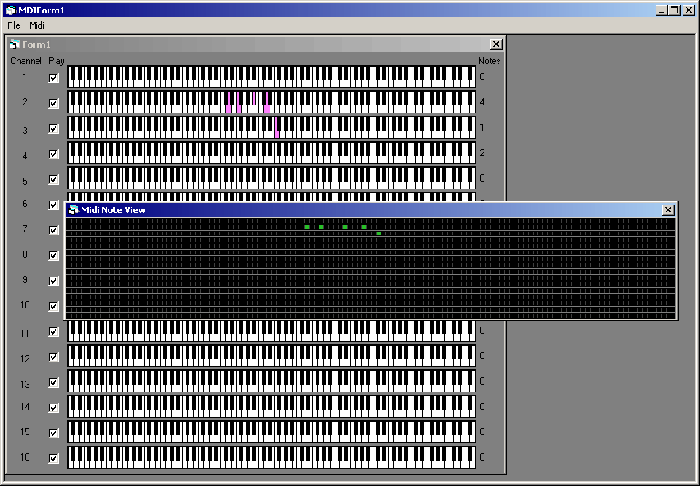



## MidiWorkShop

### Description

MidiWorkShop loads and plays a midi file, displays playing notes both in a piano roll and a grid view at the same time. Midi file is loaded fully (all events including meta and SYS-EX) into an OO hierarchy, but SYS-EX messages is not sent in this version to the midi device.
 
### More Info
 

             |
---                |---
**Submitted On**   |2004-09-22 12:45:10
**By**             |[OGUZ\_OZGUL](https://github.com/Planet-Source-Code/PSCIndex/blob/master/ByAuthor/oguz-ozgul.md)
**Level**          |Advanced
**User Rating**    |5.0 (25 globes from 5 users)
**Compatibility**  |VB 5\.0, VB 6\.0
**Category**       |[Sound/MP3](https://github.com/Planet-Source-Code/PSCIndex/blob/master/ByCategory/sound-mp3__1-45.md)
**World**          |[Visual Basic](https://github.com/Planet-Source-Code/PSCIndex/blob/master/ByWorld/visual-basic.md)
**Archive File**   |[MidiWorkSh1906736292005\.zip](https://github.com/Planet-Source-Code/oguz-ozgul-midiworkshop__1-61387/archive/master.zip)

